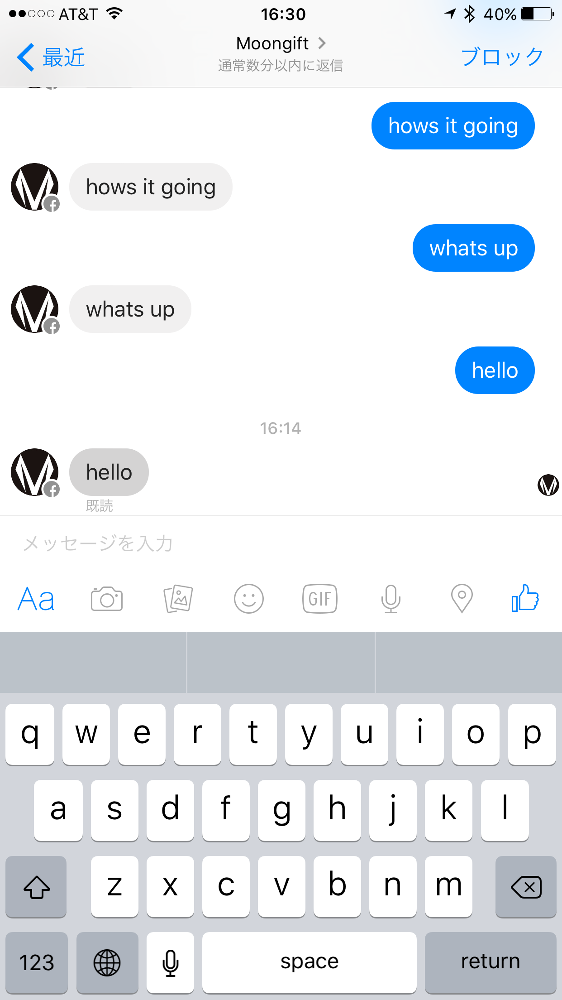

# Simple Facebook bot

This bot chat your word.

## Screen shot

## Usage

Depends on https://developers.facebook.com/docs/messenger-platform/quickstart

1. Create Facebook App
2. Add product Messenger
3. Deploy us to heroku using right button. 
4. FBBOT_TOKEN is string you can choose like **testtestabc**. Copy or remember this string.
5. Facebook app page, set webhook and permission. Input string using for FBBOT_TOKEN.
6. After connect facebook page, you find out page access token. Copy it.
7. Set page access token to heroku. If you use heroku rubygems, command it. **<token>** is page access token. `heroku config:set FBPAGE_TOKEN="<token>"`
8. Command it on terminal. `curl -ik -X POST "https://graph.facebook.com/v2.6/me/subscribed_apps?access_token=<token>"`
9. Open Facebook messanger app, Search your app.
10. Something chat, bot return the message.

You can customize me!

## License

MIT License

